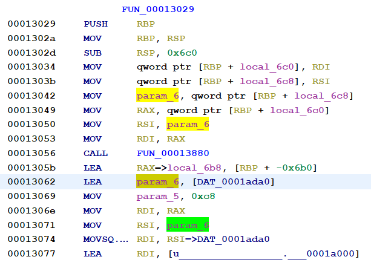
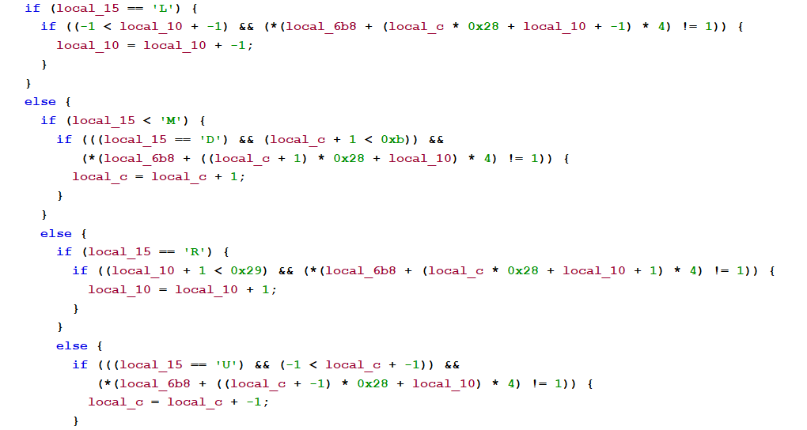

### PE x64 UEFI Secure Boot Write up

Link to the Root-Me challenge: https://www.root-me.org/fr/Challenges/Cracking/PE-x64-UEFI-Secure-Boot

Although the challenge includes a link to a website explaining how EFI files can be debugged with QEMU and gdb, 
static analysis of the file with Ghidra alone will be sufficient for determining the password. In fact, upon 
understanding how password inputs are validated, the challenge will be reduced to a Leetcode style problem that can
be solved with a recursive function.

#### Disassembly with Ghidra

After disassembling the file in Ghidra, we can search for strings that are of relevance. 

  

The panel on the right in the screenshot above shows us the presence of static strings such as `Enter the ...`,
`That's the ...` and `Failed !`. It is likely that the function(s) responsible for validating the password will
be referencing these strings.

Indeed, navigating to the (only) address referencing `Enter the ...` brings us to what appears to be a password
validation function. Note that Ghidra labels the RCX register as `param_5`, the RDX register as `param_6`, the R8
register as `param_7` and the R9 register as `param_8`.

  

Scrolling up, we can see the function starts by copying 1600 bytes of data starting from `0x0001ada0` to the local variable `local_6b8`. 

  

We can view the data as double words, most of which are either `00 00 00 00` or `00 00 00 01`, except at `0x0001b3a4`, which holds `00 00 00 02`.
There are a total of 400 such double words.

  
  
&emsp;

Returning to the function, the decompiler panel shows a loop, where at the ith iteration if-else statements potentially modify either of the
variables `local_c` or `local_10` based on the value of the ith character of the variable `local_15`. 

  

In particular

(i) - if 

As the loop has a total of 48 iterations, it is expected that the length of the password is 48.

#### Restating and solving the problem

Equivalently, we have a 10 $\times$ 40 grid whose cells are indexed from 0 to 399. We want to find paths between cell 1 and cell 385 by moving up
down, left or right. Certain cells are not accessible, and we cannot move left if we are at the leftmost column and we cannot move
right if we are at the rightmost column (i.e. continuing moving left (resp. right) will not bring us to the preceding (resp. next) row). 

The solution to the above problem is implemented in the script `rootme_uefi.py`. 
The function `find_shortest_path(start_index, end_index, cols, allowed)` in the script finds the shortest path between `start_index`
and `end_index` using recursion, where paths are only allowed to traverse grid cells specified in the `allowed` array. `cols` is the
number of columns of the grid, which for the above problem is 40. It then determines the moves made along the path, with
`U`, `D`, `L` and `R` representing "up", "down", "left" and "right" respectively. 
The most tedious aspect of this challenge is determining the indices allowed based on `DAT_0001ada0`.

Running the script, we attain the following password: `DRRRRDDDRRRRRRRDRRRRRRUUURRRRRRRRRRRDDDDLLDLLDD`. 
Although this flag is the correct one, we note that it only has 47 characters and not the expected 48. 
